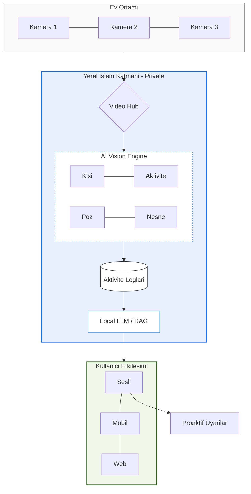

# idea.homevision-ai

**Akıllı Ev Aktivite Zekası**

> **CONCEPT REPOSITORY** - Bu repo bir fikir/konsept deposudur. Henüz implementasyon içermez.  
> `idea.*` prefix'i: Sadece fikir aşamasında olan, henüz kodlanmamış projeler için.

## Vizyon

Evinizin her odasının köşelerinde konumlandırılmış kameralar aracılığıyla, aile bireylerinin günlük aktivitelerini otomatik olarak izleyen, loglayan ve doğal dil sorularına yanıt verebilen bir yapay zeka sistemi.

---

## Problem

### Genel Kullanıcılar
- Gün içinde kaç bardak su içtiğinizi hatırlamıyorsunuz
- Egzersiz yaparken sayı saymayı unuttunuz
- Çocuğunuzun gün boyunca ne kadar kitap okuduğunu merak ediyorsunuz
- Yaşlı aile üyelerinin aktivite seviyelerini takip etmek istiyorsunuz
- "Son zamanlarda az mı hareket ediyorum?" sorusuna objektif bir yanıt arıyorsunuz

### Engelli Bireyler
- **Görme engelli** bireyler ev içinde bağımsız hareket etmekte zorlanıyor
- Nesnelerin yerini bulmak için sürekli yardıma ihtiyaç duyuyorlar
- Evin durumu hakkında anlık bilgi alamıyorlar
- Mevcut asistan teknolojileri (Alexa, Google Home) sadece sesli komutlara yanıt veriyor, **proaktif bilgi sağlamıyor**

## Çözüm

HomeVision AI, evinizdeki kameralar aracılığıyla:

1. **Sürekli İzleme**: Her odadaki aktiviteleri 7/24 izler
2. **Kişi Tanıma**: Aile bireylerini ayırt eder
3. **Aktivite Sınıflandırma**: Yapılan eylemleri otomatik kategorize eder
4. **Akıllı Loglama**: Tüm aktiviteleri zaman damgasıyla kaydeder
5. **Doğal Dil Sorgulama**: Sorularınıza anlamlı yanıtlar verir

---

## Örnek Kullanım Senaryoları

### Soru-Cevap Örnekleri

```
User: "Bugün kaç bardak su içtim?"
AI:   "Bugün toplam 6 bardak su içtiniz. Son içtiğiniz 14:32'de mutfaktaydı."

User: "Az önce kaç şınav çektim?"
AI:   "Son 5 dakika içinde 23 şınav çektiniz. Ortalama tempo: 12 şınav/dakika."

User: "Bu hafta en çok hangi odada vakit geçirdim?"
AI:   "Bu hafta en çok oturma odasında vakit geçirdiniz (toplam 28 saat). 
       İkinci sırada çalışma odası (18 saat)."

User: "Çocuklar bugün ne kadar TV izledi?"
AI:   "Ahmet 2 saat 15 dakika, Ayşe 45 dakika TV izledi."

User: "Kedim bugün ne yaptı?"
AI:   "Luna bugün çoğunlukla yatak odasında uyudu (6 saat), 
       3 kez mama kabına gitti ve 45 dakika pencere kenarında oturdu."
```

### Erişilebilirlik: Görme Engelli Kullanıcı Senaryoları

> **Konsept:** Kameralar, görme engelli bireyin **gözleri** olur. Akıllı hoparlör veya kulaklık entegrasyonu ile ev hakkında anlık, sesli bilgi alabilirler.

#### Soru-Cevap Modu
```
User: "Mutfakta ne var?"
AI:   "Mutfakta kimse yok. Tezgahın üzerinde bir tabak ve bardak var. 
       Buzdolabının kapağı kapalı. Ocak kapalı durumda."

User: "Oturma odasında kim var?"
AI:   "Oturma odasında Ayşe koltukta oturuyor. TV açık."

User: "Kapıya giden yol nasıl?"
AI:   "Önünüzde 3 metre düz yol var. Solda sandalye var, dikkat edin. 
       Kapı sağda, 4 adım sonra."

User: "Gözlüklerimi nereye koydum?"
AI:   "Son gördüğüm yer: Salon, sehpanın üzeri. 2 saat önce."

User: "Evde başka kim var?"
AI:   "Ahmet çalışma odasında, anneniz yatak odasında dinleniyor."
```

#### Gerçek Zamanlı Mod (Real-time Awareness)

> **Kulaklık ile sürekli çevresel farkındalık** - Kullanıcı hareket ederken veya otururken arka planda olan her şeyi bilir.

```
[Sürekli Mod - Kulaklıktan]

AI: "Arkandan Ahmet geliyor, 3 metre uzakta."
AI: "Solunda kedi, dikkat et."
AI: "Önünde sandalye var, sağa doğru ilerle."
AI: "Mutfağa girdin. Tezgah solunda, buzdolabı karşında."
AI: "Ayşe arkandan sesleniyor."
AI: "Yere bir şey düştü, sağ tarafında."
AI: "Kapı açıldı, biri eve girdi... Ahmet."
```

#### Proaktif Uyarılar
```
AI: "Dikkat: Mutfakta ocak 10 dakikadır açık ama kimse yok."
AI: "Kapı zili çaldı. Kapıda bir kargo görevlisi var, elinde paket tutuyor."
AI: "Su sesi geliyor, banyo musluğu açık kalmış olabilir."
```

### Dashboard Özellikleri

- Günlük/Haftalık/Aylık aktivite raporları
- Aile üyesi bazlı istatistikler
- Hareket ve egzersiz takibi
- Su/yemek tüketim tahmini
- Uyku düzeni analizi
- Kişisel hedefler ve hatırlatmalar

---

## Teknik Mimari (Konsept)



---

## Tanınacak Aktiviteler

### Temel Aktiviteler
| Aktivite | Detay |
|----------|-------|
| Su/İçecek İçme | Bardak sayısı, içecek türü tahmini |
| Yemek Yeme | Öğün zamanları, süre |
| Yürüme | Adım tahmini, oda geçişleri |
| Egzersiz | Tip (şınav, mekik, squat), tekrar sayısı |
| TV İzleme | Süre, program değişikliği |
| Telefon Kullanımı | Süre |
| Okuma | Süre |
| Bilgisayar Kullanımı | Süre |
| Uyuma/Dinlenme | Başlangıç, bitiş, süre |
| Ev İşleri | Temizlik, bulaşık, çamaşır |

### Gelişmiş Aktiviteler
| Aktivite | Detay |
|----------|-------|
| Bebek Bakımı | Besleme, bez değiştirme, oyun |
| Evcil Hayvan | Besleme, oyun, veteriner hatırlatmaları |
| Oyun Oynama | Süre, konsol/PC ayrımı |
| Müzik Aleti | Pratik süresi |
| Meditasyon/Yoga | Süre, düzenlilik |

---

## Erişilebilirlik Özellikleri

> **"Kameralar onların gözleri olur."**

Bu sistem, engelli bireyler için **hayat değiştirici** potansiyele sahiptir.

### Görme Engelli Modu

| Özellik | Açıklama |
|---------|----------|
| **Sahne Tasviri** | Herhangi bir oda hakkında anlık sesli betimleme |
| **Nesne Konumu** | "Gözlüklerim nerede?" - Son görülen konum |
| **Navigasyon Yardımı** | Oda içi yönlendirme, engel uyarıları |
| **Kişi Tespiti** | Evde kim var, nerede, ne yapıyor |
| **Proaktif Uyarılar** | Tehlike durumları (ocak açık, kapı zili, vb.) |
| **Misafir Tanıma** | Kapıda kim olduğunu sesli bildirme |

### İşitme Engelli Modu

| Özellik | Açıklama |
|---------|----------|
| **Ses→Metin** | Kapı zili, alarm gibi sesleri görsel/titreşim bildirimi |
| **Dashboard Uyarıları** | Tüm sesli olaylar yazılı log |
| **Işık Bildirimleri** | Akıllı ampullerle entegrasyon |

### Yaşlı/Hareket Kısıtlı Mod

| Özellik | Açıklama |
|---------|----------|
| **Düşme Algılama** | Ani düşme tespiti ve acil durum bildirimi |
| **Hareketsizlik Uyarısı** | Uzun süre hareket yoksa aile üyelerine bildirim |
| **İlaç Hatırlatma** | Görsel ilaç kutusu takibi |
| **Rutin Takibi** | Normal rutinden sapma tespiti |

### Entegrasyonlar

- **Akıllı Hoparlörler**: Google Home, Amazon Alexa, Apple HomePod
- **Giyilebilir Cihazlar**: Akıllı saat titreşim bildirimleri
- **Akıllı Ev**: Işık, kapı kilidi, termostat kontrolü

---

## Gizlilik ve Güvenlik (Kritik)

### Temel Prensipler

1. **Yerel İşleme**: Tüm video işleme yerel sunucuda yapılır
2. **Sıfır Bulut**: Ham video asla buluta gönderilmez
3. **Şifreli Depolama**: Tüm loglar şifreli saklanır
4. **Aile Kontrolü**: Her birey kendi verilerini yönetir
5. **Silme Hakkı**: İstenilen zaman dilimi silinebilir
6. **Misafir Modu**: Misafirler izlenmez/loglanmaz

### Gizlilik Bölgeleri

```
[KAPALI] Yatak Odası - Sadece hareket sensörü (kamera kapalı)
[KAPALI] Banyo - Tamamen hariç
[AÇIK]   Salon - Tam izleme
[AÇIK]   Mutfak - Tam izleme
[OPT]    Çalışma Odası - Opsiyonel
```

### Veri Saklama Politikası

- **Ham Video**: Saklanmaz (real-time işlenir ve atılır)
- **Aktivite Logları**: 1 yıl (kullanıcı ayarlayabilir)
- **İstatistikler**: Sınırsız (anonim agregasyon)

---

## Potansiyel Teknoloji Stack'i

### Donanım
- Raspberry Pi 5 + AI HAT (her oda için)
- NVIDIA Jetson Nano/Orin (merkezi işlem)
- IP Kameralar (geniş açı, gece görüşü)
- Mikrofon dizisi (opsiyonel ses komutları)

### Yazılım
- **Video İşleme**: OpenCV, FFmpeg
- **AI/ML**: 
  - YOLOv8 (nesne tespiti)
  - MediaPipe (poz tahmini)
  - DeepSORT (kişi takibi)
  - Custom CNN (aktivite sınıflandırma)
- **Veritabanı**: TimescaleDB (time-series), PostgreSQL
- **Backend**: FastAPI, Python
- **LLM**: Ollama + Llama 3.2 (yerel), veya GPT-4 API
- **Frontend**: React/Next.js, React Native
- **Ses Asistanı**: Whisper (STT), TTS

---

## Potansiyel Yol Haritası

### Faz 1: MVP (Minimum Viable Product)
- [ ] Tek oda, tek kamera
- [ ] Temel kişi tespiti
- [ ] 5 temel aktivite (oturma, ayakta durma, yürüme, su içme, telefon kullanımı)
- [ ] Basit CLI sorgu arayüzü

### Faz 2: Çoklu Oda
- [ ] Birden fazla kamera entegrasyonu
- [ ] Kişi re-identifikasyonu (odalar arası takip)
- [ ] Web dashboard
- [ ] 15+ aktivite desteği

### Faz 3: Akıllı Özellikler
- [ ] Doğal dil sorgulama (LLM)
- [ ] Anomali tespiti (düşme, uzun hareketsizlik)
- [ ] Sağlık önerileri
- [ ] Aile istatistikleri

### Faz 4: Ekosistem
- [ ] Mobil uygulama
- [ ] Sesli asistan entegrasyonu
- [ ] Akıllı ev entegrasyonları (Home Assistant)
- [ ] Wearable cihazlarla senkronizasyon

---

## Açık Sorular

1. **Poz tahmini doğruluğu**: Düşük ışıkta egzersiz sayımı ne kadar güvenilir?
2. **Eşya tanıma**: Su bardağı vs kahve fincanı ayrımı mümkün mü?
3. **Çoklu kişi**: Aynı anda birden fazla kişi aktivite yapınca?
4. **Gizlilik dengesi**: Misafirler için otomatik bulanıklaştırma?
5. **Maliyet**: Tüm ev için tahmini donanım maliyeti?

---

## İlham Kaynakları

- Amazon Just Walk Out teknolojisi
- Google Nest Hub activity tracking
- Apple Watch fitness tracking (görsel versiyon)
- Baby monitor'ların evrimi
- **Be My Eyes** uygulaması (görme engelliler için uzaktan yardım)
- **Seeing AI** (Microsoft'un görme engelliler için AI uygulaması)

---

## Sosyal Etki

Bu proje sadece bir "ev otomasyonu" değil, **erişilebilirlik teknolojisi** olarak düşünüldüğünde:

- Dünyada **285 milyon** görme engelli birey var (WHO)
- Ev içi bağımsızlık, yaşam kalitesini dramatik artırır
- Bakıcı/aile yükünü azaltır
- Yaşlanan nüfus için "yerinde yaşlanma" (aging in place) imkanı

> *"Teknoloji, engelleri kaldırmak için var."*

---

## Notlar

*Bu bölüm, fikir geliştikçe güncellenecektir.*

---

## Lisans

Bu konsept dokümanı [CC BY 4.0](LICENSE) (Creative Commons Attribution 4.0) lisansı altındadır.

- Paylaşabilirsiniz
- Değiştirebilirsiniz
- Ticari kullanabilirsiniz
- **Kaynak göstermek zorundasınız**
